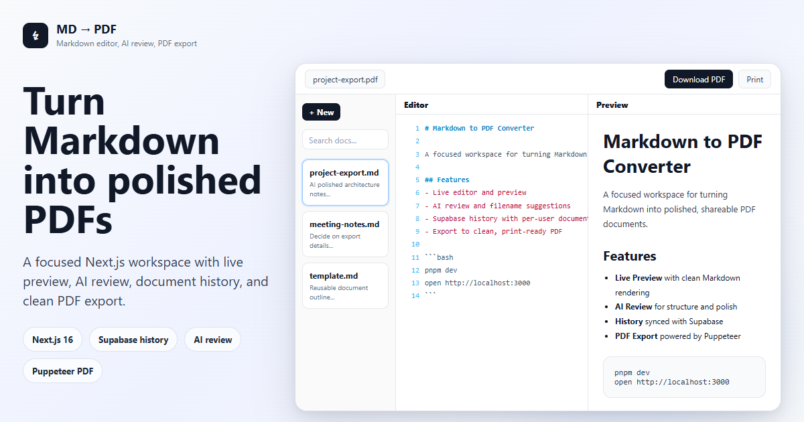

[](https://github.com/neozhu/md-to-pdf-app/actions/workflows/build.yml)
[](https://github.com/neozhu/md-to-pdf-app/actions/workflows/docker-publish.yml)
[](https://github.com/neozhu/md-to-pdf-app/actions/workflows/flow.yml)

# Markdown to PDF Converter

A Next.js 16 app to edit Markdown, run human-approved AI review, and export clean PDFs.




## Why I Built This App

This app was built for two practical documentation workflows:

1. **Project documentation delivery requires PDF, but authoring is usually Markdown**
Teams often need PDF as the final delivery format for project documents. At the same time, when writing with GPT or other LLMs, the output is usually in Markdown. This app bridges that gap by converting Markdown into clean, delivery-ready PDF files.

2. **Copied online articles often lose structure and formatting**
When saving high-quality online content by copy/paste, heading hierarchy, lists, code blocks, and spacing are often damaged. The AI Review Agent is designed to repair structure first and then polish language, so the document becomes readable and professional again.

## Highlights

- Live split editor + preview with GFM support and syntax highlighting
- High-quality PDF generation via Puppeteer (Chrome)
- **Copy to clipboard for OneNote** — one-click copy with inline-styled HTML so content pastes into OneNote (and Word/Outlook) with full formatting preserved
- Staged AI review pipeline (reviewer → user approval → editor)
- Live progress updates over SSE (`stage`, `result`, `error`)
- Per-user document history with Supabase Auth + RLS, dark mode, responsive UI
- Docker/Docker Compose deployment ready

## 🚀 Quick Start

### Requirements

- Node.js 20+
- pnpm
- Docker (optional)

### Local Development

```bash
git clone https://github.com/neozhu/md-to-pdf-app.git
cd md-to-pdf-app
pnpm install
pnpm dev
```

Open [http://localhost:3000](http://localhost:3000).

### Production Build

```bash
pnpm build
pnpm start
```

## AI Review (Human-Approved Agent Workflow)

- **Review**: the reviewer returns a structured, conservative edit plan.
- **Approval**: the user can edit or reject the review before any document change.
- **Polish**: the editor applies only the approved brief, then factual guards inspect the result.
- **Safe Apply Flow**: UI receives `polishedMarkdown`, `changed`, `tokenUsage`, and `toolInsights`; user accepts or keeps original.


 
 

Implementation source:
- [`app/api/ai-review/route.ts`](app/api/ai-review/route.ts)
- [`components/md/md-dashboard.tsx`](components/md/md-dashboard.tsx)

## 📁 Project Structure

```text
md-to-pdf-app/
├── app/
│   ├── api/ai-review/      # AI review API (SSE)
│   ├── api/pdf/            # PDF generation API
│   └── page.tsx            # Main UI entry
├── components/md/          # Editor/preview/dashboard
├── lib/
│   └── markdown/
│       ├── copy-html.ts    # OneNote-friendly clipboard copy (inline-styled HTML)
│       ├── print.ts        # Browser print helper
│       └── render.ts       # Markdown → sanitized HTML
├── docs/                   # Docs and SQL setup notes
└── DOCKER_DEPLOYMENT.md    # Detailed Docker guide
```

## 🔧 Configuration

Create a `.env.local`:

```env
OPENAI_API_KEY=

# Optional
# OPENAI_MODEL=gpt-5-mini
# OPENAI_BASE_URL=https://api.openai.com/v1
# PUPPETEER_EXECUTABLE_PATH=/usr/bin/google-chrome-stable

# Supabase (history persistence)
# Create table via docs/supabase/md_history_docs.sql
# NEXT_PUBLIC_SUPABASE_URL=
# NEXT_PUBLIC_SUPABASE_PUBLISHABLE_DEFAULT_KEY=
```

## Supabase Auth Setup

1. In Supabase Auth, enable Email/Password provider.
2. Run SQL from [`docs/supabase/md_history_docs.sql`](docs/supabase/md_history_docs.sql).
3. Start the app and open `/login` to sign in.
4. Optional: configure `NEXT_PUBLIC_APP_URL` so password reset emails use the correct callback domain.

`/` is login-protected and history APIs are user-scoped via RLS.

PDF styling is defined in [`app/api/pdf/route.ts`](app/api/pdf/route.ts).

## 🐳 Docker

```bash
docker compose up -d
docker compose logs -f
docker compose down
```

For full options, see [`DOCKER_DEPLOYMENT.md`](DOCKER_DEPLOYMENT.md).

## Scripts

- `pnpm dev` - start development server
- `pnpm build` - build for production
- `pnpm start` - start production server
- `pnpm lint` - run ESLint

## 🤝 Contributing

PRs are welcome. For larger changes, open an issue first.

## 📝 License

MIT. See [`LICENSE`](LICENSE).
